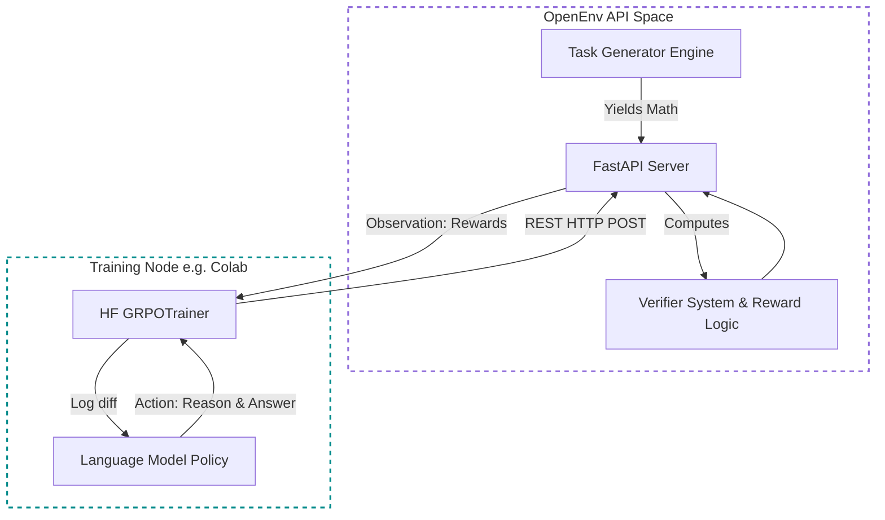
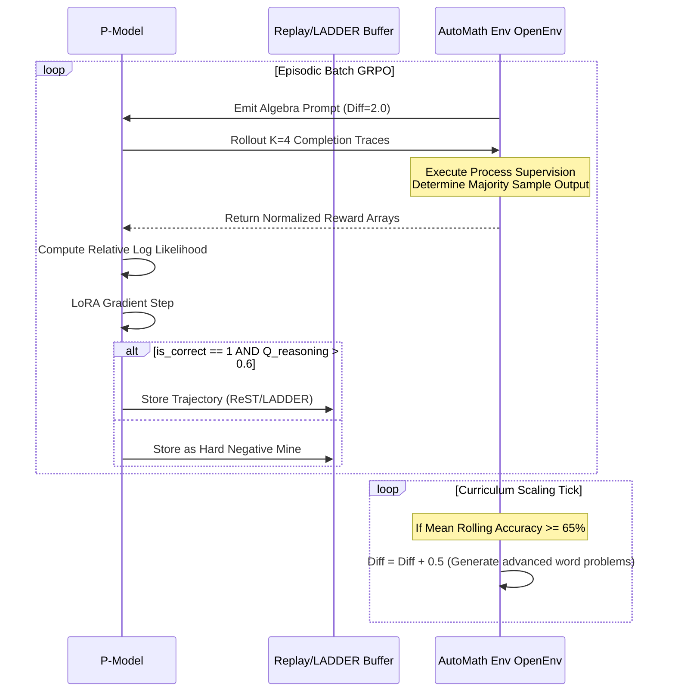

# ♾️ AutoMathReasoner: Self-Improving Mathematics RL Environment

**AutoMathReasoner** is an OpenEnv-compliant reinforcement learning server specifically formulated to bootstrap mathematical intelligence in Large Language Models (LLMs). Rooted in principles from DeepSeekMath and Group-Relative Policy Optimization (GRPO), it facilitates absolute, fully autonomous self-improvement through rigorous dense reward curves, exploration entropy, and curriculum scaling. 

This repository wraps the environment architecture securely into a lightweight Docker-backed REST API for direct ingestion in Google Colab, SageMaker, or distributed compute arrays.

---

## 🏗️ Architecture Overview

The system strictly decouples the interactive RL environment from the learning engine. The `FastAPI` instance serves purely as the mathematical world simulation.



---

## 🎯 Reward Composite Hierarchy (Graders)

Instead of binary scalar rewards (0 for incorrect, 1 for correct), the AutoMathReasoner relies on an aggressive mathematical dense reward architecture designed to shape logical structures rather than just end targets.

The absolute reward matrix evaluates as:

$$R = 0.35C + 0.15\tanh(Q) + 0.1P + 0.1R_{\text{ref}} + 0.15D - 0.05E + 0.1X + \mathcal{N}(0, \sigma^2)$$

### Individual Mathematical Graders

- **Correctness ($C$):** $C \in \{0.0, 1.0\}$. Passed through an exact match, numeric bound tolerance limit, and generic python evaluation. E.g. correctly evaluating `3.1415 = 3.14159`.
- **Reasoning Squashing ($Q_{\text{smooth}}$):** $Q_{\text{smooth}} = \tanh(Q)$. Uses hyperbolic tangent functions bounding heuristic step-formatting markers to ensure extreme verbosity does not dominate correctness.
- **Process Supervision ($P$):** A step-aware structural logic test that algorithmically assigns $-0.5$ scalar penalties for hallucinatory inferential jumps.
- **Reflection Parsing ($R_{\text{ref}}$):** Tracks deducing logic boundaries ("Wait", "What could be wrong"). Rewards $+1.0$ for successful self-correction routing, and $-0.5$ if it reflects into a broken contradiction.
- **Entropic Exploration ($X$):** Rewards unique reasoning path token variance mapped dynamically against historical encounter probability:
  $$X = \frac{\log(1 + \text{unique\_ratio})}{\sqrt{1 + \text{times\_seen\_problem}}}$$
- **Token Efficiency Penalty ($E$):** Penalizes overly verbose traces dynamically. It anchors outputs safely against a $50$-token optimal length via an inverse negative Gaussian curve:
  $$E = \exp\left(-\left(\frac{\text{approx\_tokens} - 50}{50}\right)^2\right) - 1.0$$
- **History Diversity ($D$):** Employs strict, absolute mathematical blocks against network hacking and identical solution repetition loops:
  $$D = \begin{cases} -\exp(1.0) & \text{if answer repeats exactly} \\ 1.0 & \text{otherwise} \end{cases}$$

---

## 🔄 Self-Curriculum Training Loop

The pipeline intrinsically manages mathematical difficulty scaling while systematically applying ReST-Style trajectory filtration to block network poisoning. 



---

## 💻 Steps to Get the Code Running on Your System

### 1. Initialize the Environment Server Locally

You can launch the core OpenEnv FastAPI server effortlessly using `uv` to orchestrate dependencies automatically. This handles environment states entirely.

```bash
# Clone the repository
git clone https://github.com/yourusername/AutoMathReasoner.git
cd AutoMathReasoner

# Install native editable package bindings via uv
uv pip install -e .

# Launch the FastAPI Server Engine
uv run server
```
_The server is now live at `http://localhost:7860`. You can visit `http://localhost:7860/docs` to view the raw interactive environment endpoints._

### 2. Begin Reinforcement Learning (GRPO)

Once your server is running (either locally or deployed to Hugging Face Spaces), execute the automated GRPO rollout.

To execute the free-tier Colab notebook simulation pointing back at your running server:
```bash
# In an entirely separate terminal
python train/colab_train.py
```
*(Ensure `HF_SPACE_URL` in `train/colab_train.py` points to your `http://localhost:7860` or deployed Space domain!)*
