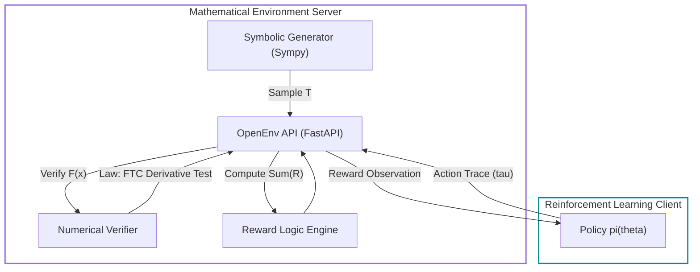
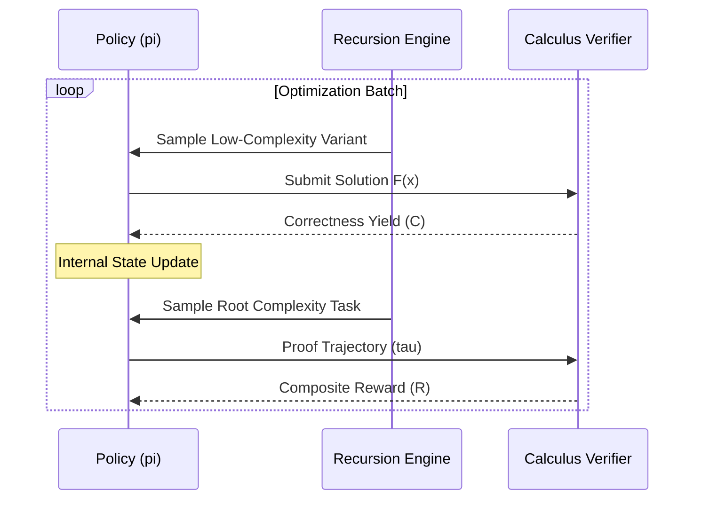

# ♾️ AutoMathReasoner: Autonomous Mathematical Intelligence Environment

**AutoMathReasoner** is an OpenEnv-compliant reinforcement learning world formulated for the **Recursive Policy Refinement** of Language Models. The system focuses on the domain of **Symbolic Calculus (Indefinite Integration)**, utilizing a dense, multi-objective reward architecture to bridge complexity gaps in mathematical reasoning.

---

## 🚀 Core Reasoning Technologies

The environment implements several advanced logic-steering protocols to ensure convergence on complex mathematical primitives.

### 1. Recursive Difficulty Ascent (LADDER)
The system employs a **Recursive Task Decompositon** mechanism where a failure on a parent task $\mathcal{T}_p$ triggers a search for a solvable basis $\{\mathcal{T}_1, \dots, \mathcal{T}_k\}$. 

Given a complexity operator $\Phi$, we satisfy:
$$\Phi(\mathcal{T}_p) = \sum_{i=1}^n \omega_i \Phi(\mathcal{T}_i)$$
Where variants $\mathcal{T}_i$ represent "stepping stones" that allow the policy to acquire base-identities before attempting the coupled root problem.

### 2. Test-Time Adaptive Policy (TTRL)
For "truly difficult" integrals at the boundary of the model's current capability, the system supports **Inference-Time Group Optimization**. When presented with a novel hard task $\mathcal{G}$, the model:
1. Generates $m$ simpler variants on-the-fly.
2. Performs a high-step micro-RL update on these variants.
3. Cold-starts the final inference on $\mathcal{G}$ with the adapted policy weights.

Mathematically, we solve for an optimal local parameter shift:
$$\theta^* = \arg \max_{\theta'} \mathbb{E}_{\mathcal{T} \sim \text{variants}(\mathcal{G})} [ R(\tau, \pi_{\theta'}) ]$$

### 3. Process-Aware Reward Shaping
Unlike binary "sparse" reward systems, we employ **Dense Process Supervision**. Every primitive transformation (e.g. $u$-substitution, integration by parts) is identified as a logical node. 

The reward $R_{\text{shape}}$ is assigned as the line integral over the reasoning trajectory $\tau$:
$$R_{\text{shape}} = \int_{\tau} \Psi(\mathbf{z}) d\mathbf{z}$$
where $\Psi$ evaluates the structural validity of each state transition relative to the ground-truth simplification steps.

### 4. Hard Negative mining (Problem Persistence)
Failed tasks $\mathcal{T}_{fail}$ are not discarded. They are prioritized in the sampling buffer with a weight $W$ proportional to their failure frequency:
$$W(\mathcal{T}) \propto e^{\lambda \cdot \text{failures}(\mathcal{T})}$$
This forces the policy to repeatedly encounter "bottleneck" logic until the primitive is solved.

---

## 🏗️ System Architecture

The environment architecture follows a strictly decoupled schema between task generation, solution validation, and policy refinement.



---

## 🏗️ Systemic Logic: Recursive Difficulty Ascent

The environment operates via **Autonomous Difficulty Scaling**. Instead of fixed-difficulty benchmarks, a problem $\mathcal{T}$ is decomposed into a hierarchical tree of simpler primitives. For any parent problem $\mathcal{T}_{\text{p}}$ that fails to elicit a reward, the system generates a set of variants $\{\mathcal{T}_i\}$ such that the complexity metric $\mathcal{M}$ satisfies:

$$\mathcal{M}(\mathcal{T}_i) < \mathcal{M}(\mathcal{T}_{\text{p}})$$

This ensures a continuous gradient for the learner, moving from fundamental algebraic identities to nested transcendental integrals.

---

## 🎯 The Reward Law

The terminal reward $R_{\Sigma}$ is a weighted composite of seven distinct mathematical and structural signals, designed to penalize hacking and reward rigorous proof-like trajectories:

$$R_{\Sigma} = \alpha C + \beta Q + \gamma P + \delta R_{\text{ref}} + \eta D + \zeta E + \lambda X + \epsilon$$

Where the weights are calibrated as $\alpha=0.35, \beta=0.15, \gamma=0.1, \delta=0.1, \eta=0.15, \zeta=0.05, \lambda=0.1$.

### 1. Fundamental Correctness ($C$)
Derived from the **Numerical Multi-point Quadrature Protocol**. A predicted solution $F_{\theta}(x)$ is verified against the target integrand $f(x)$ through the derivative identity:

$$C = \begin{cases} 1.0 & \text{if } \forall x_i \in \mathbb{X}, \quad | \frac{d}{dx}F_{\theta}(x_i) - f(x_i) | < 10^{-2} \\ 0.0 & \text{otherwise} \end{cases}$$

Where $\mathbb{X} = \{x_1, \dots, x_5\}$ is a set of random points sampled from $\mathcal{U}(-5, 5)$.

### 2. Reasoning Formatting ($Q$)
Calculates the structural density of the reasoning trace using a hyperbolic tangent squashing function to bound heuristic markers:

$$Q = \tanh(\omega \cdot \text{count}(\text{markers}))$$

### 3. Process Supervision ($P$)
Assigns a scalar reward for explicit step-wise transition logic. It algorithmically penalizes "Inferential Jumps" where the ratio of reasoning tokens to mathematical complexity falls below a critical threshold.

### 4. Reflection Logits ($R_{\text{ref}}$)
Rewards the presence of self-correction tokens when they lead to a terminal state correction. If the model reflects ($r=1$) but fails to correct the solution ($c=0$), it suffers a penalty of $-0.5$.

### 5. Trajectory Diversity ($D$)
Prevents the policy from converging on rote-memorized repetitive strings. If the current answer $A_t$ has been seen in history $\mathcal{H}$, an exponential penalty is applied:

$$D = \begin{cases} -\exp(1.0) & \text{if } A_t \in \mathcal{H} \\ 1.0 & \text{otherwise} \end{cases}$$

### 6. Information Density Efficiency ($E$)
Guides the model toward concise mathematical proofs using a Gaussian decay centered at an optimal token length $\phi=50$:

$$E = \exp\left(-\left(\frac{\text{len}(\tau)/4 - \phi}{\phi}\right)^2\right) - 1$$

### 7. Global Exploration Bonus ($X$)
Rewards token-level variance relative to the frequency of problem encounters $s$:

$$X = \frac{\log(1 + \nu)}{\sqrt{1 + s}}$$

Where $\nu$ is the ratio of unique tokens in the reasoning trace $\tau$.

---

## 🔄 The Interaction Loop

The environment manages the **Difficulty Gradient** to ensure the policy $\pi_{\theta}$ maintains exploration stability.



---

## 💻 Running the Environment

### 1. Launch the Environment
```bash
# Install local calculus bindings
uv pip install -e .

# Start the environment server
uv run server
```

### 2. Training Initiation
```bash
# Executes the recursive training sequence
python train/train_grpo.py
```
